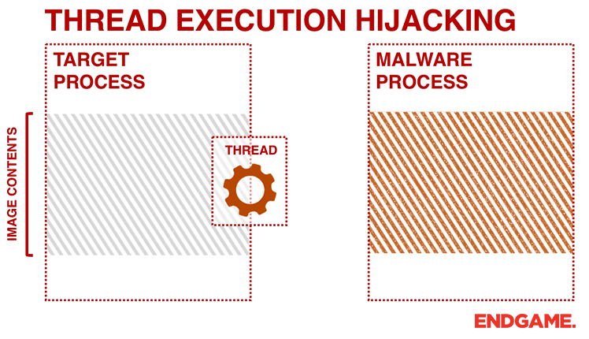

# What's Thread Execution Hijacking 
* Thread Execution Hijacking is a method of executing arbitrary code in the address space of a separate live process. Thread Execution Hijacking is commonly performed by suspending an existing process then unmapping/hollowing its memory, which can then be replaced with malicious code or the path to a DLL.

